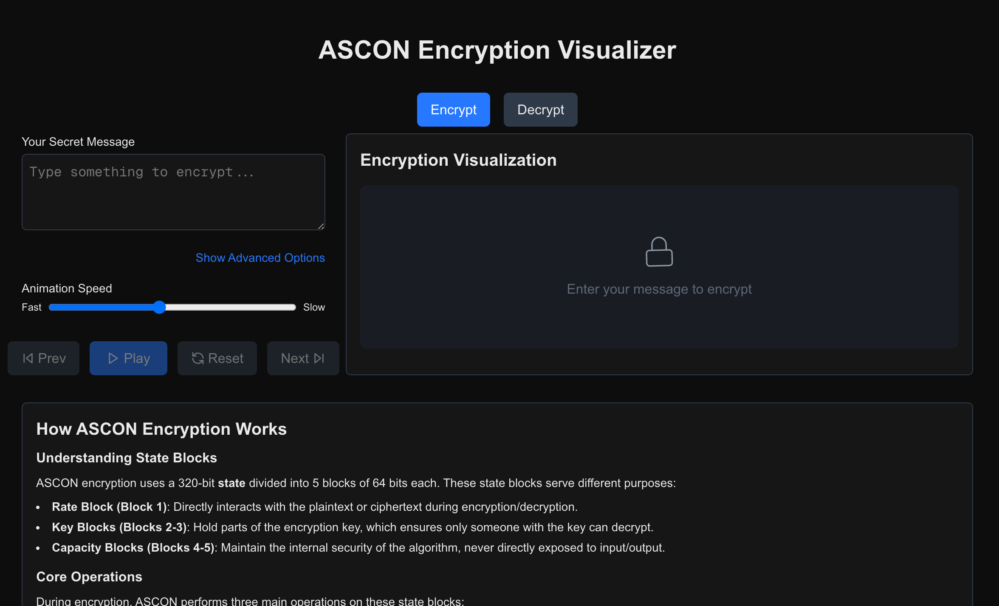

# ASCON Encryption Visualizer

An interactive web application that visualizes the ASCON lightweight encryption algorithm. This visualizer helps users understand how the ASCON encryption and decryption processes work by animating each step of the algorithm.



## About ASCON

ASCON is a family of lightweight cryptographic algorithms designed to be efficient and easy to implement, even with added countermeasures against side-channel attacks. It has been selected as the new standard for lightweight authenticated encryption and hashing in:

- The **NIST Lightweight Cryptography competition** (2019–2023)
- The **CAESAR competition** (2014–2019) as the primary choice for lightweight authenticated encryption

ASCON is specified in NIST SP 800-232 (initial public draft): "Ascon-based Lightweight Cryptography Standards for Constrained Devices: Authenticated Encryption, Hash, and Extendable Output Functions".

### Key Features of ASCON

- Efficient in software and hardware, particularly for constrained devices
- Easy to implement securely, with efficient side-channel countermeasures
- Provides authenticated encryption, hashing, and message authentication

## Visualizer Features

This interactive visualizer demonstrates:

- **Encryption and Decryption**: See how plaintext is converted to ciphertext and vice versa
- **Step-by-Step Animation**: Visualize each phase of the encryption/decryption process
- **State Block Visualization**: Understand the 320-bit state divided into 5 blocks of 64 bits each
- **Core Operations**: Watch how Addition of Round Constants, Substitution Layer, and Linear Diffusion work
- **Character-Level Transformation**: See how each character is processed during encryption/decryption

## How the Visualizer Works

The visualizer breaks down the ASCON algorithm into its core components:

1. **State Blocks**: Shows the 5 state blocks (Rate, Key, and Capacity blocks) and their roles
2. **Encryption/Decryption Process**: Animates the transformation from plaintext to ciphertext (or vice versa)
3. **Round Operations**: Visualizes the three main operations (addition of constants, substitution, diffusion)
4. **Authentication**: Demonstrates how the authentication tag is generated to verify message integrity

## Getting Started

First, run the development server:

```bash
pnpm dev
```

Open [http://localhost:3000](http://localhost:3000) with your browser to see the result.

## Learn More

To learn more about ASCON and lightweight cryptography:

- [Official ASCON Website](https://ascon.isec.tugraz.at/)
- [ASCON Specification](https://ascon.isec.tugraz.at/specification.html)
- [ASCON Implementations](https://ascon.isec.tugraz.at/implementations.html)
- [NIST Lightweight Cryptography Competition](https://csrc.nist.gov/projects/lightweight-cryptography)

## Credits

ASCON is designed and maintained by a team of cryptographers from:
- Graz University of Technology
- Infineon Technologies
- Intel Labs
- Radboud University

## Built With

- [Next.js](https://nextjs.org/) - The React framework used
- [Framer Motion](https://www.framer.com/motion/) - For animations
- [Tailwind CSS](https://tailwindcss.com/) - For styling

## Deploy on Vercel

The easiest way to deploy your Next.js app is to use the [Vercel Platform](https://vercel.com/new?utm_medium=default-template&filter=next.js&utm_source=create-next-app&utm_campaign=create-next-app-readme) from the creators of Next.js.

Check out [Next.js deployment documentation](https://nextjs.org/docs/app/building-your-application/deploying) for more details.
